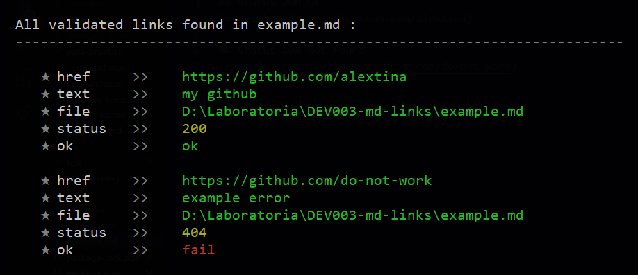

# md-Links-alextina

md-links-alextina is a library that helps you visualize and validate the HTTP status of links containing Markdown files.

## Index

* [1. Preamble](#1-preamble)
* [2. Installation](#2-installation)
* [3. Getting Started](#3-getting-started)
* [4. Exmples](#4-examples)
* [4. Getting Help](#5-getting-help)


***

## 1. Preamble

`Markdown` is a lightweight markup language that is very popular among developers. It is used on many platforms that handle plain text (such as GitHub, forums, blogs, etc.) and it is very common to find several files in that format in any type of repository (starting with the traditional README.md).

These `Markdown` files usually contain links that are often broken or no longer valid, which greatly diminishes the value of the information being shared.

md-links-alextina provides a solution to developers by reading and analyzing `Markdown` files to verify the links they contain and report some statistics.


## 2. Installation

You can install md-links-alextina through npm:

```
npm install md-links-alextina
```

## 3. Getting Started

To use md-links-alextina, run the following command:

```
md-links <path> [--validate] [--stats]
```

Replace `<path>` with the path to the Markdown file or directory you want to check.


## 4. Examples

### Example 1


### Example 2




### Example 3


### Example 4


## 5. Getting Help

To get help, run either of the following commands:

```
md-links --help
```

```
md-links --h
```

## 6. Autora

Alejandra Castillo Avila

[](https://github.com/alextina)
[](mailto:castilloavilaa@gmail.com)
[](https://www.linkedin.com/in/alejandracastilloavila/)